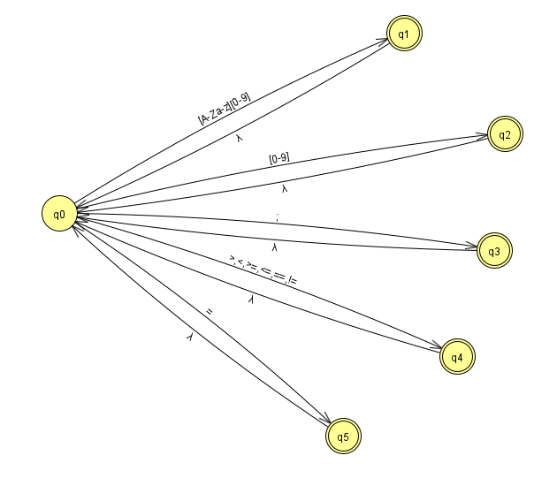

# Analisador Léxico

## Descrição

Este projeto é uma implementação simples de um analisador léxico em Java. Ele foi projetado para processar expressões aritméticas e verificar se os tokens na expressão são válidos com base em uma série de padrões pré-definidos. O analisador identifica identificadores, números, operadores relacionais, atribuições e pontos-vírgulas.

## Funcionalidades

- **Identificação de Tokens**: O analisador reconhece identificadores, números, operadores relacionais (`>`, `<`, `>=`, `<=`, `==`, `!=`), operadores de atribuição (`=`) e pontos e vírgulas (`;`).
- **Tokenização**: Divide a expressão em tokens usando espaços e ponto e vírgula como delimitadores.
- **Verificação de Tokens**: Verifica se cada token está de acordo com os padrões definidos e garante que a expressão seja válida.

 

# Lexical Analyzer

## Description

This project is a simple implementation of a lexical analyzer in Java. It is designed to process arithmetic expressions and verify if the tokens in the expression are valid based on a set of predefined patterns. The analyzer identifies identifiers, numbers, relational operators, assignments, and semicolons.

## Features

- **Token Identification**: The analyzer recognizes identifiers, numbers, relational operators (`>`, `<`, `>=`, `<=`, `==`, `!=`), assignment operators (`=`), and semicolons (`;`).
- **Tokenization**: Splits the expression into tokens using spaces and semicolons as delimiters.
- **Token Verification**: Checks if each token adheres to the defined patterns and ensures that the expression is valid.

  
## Automato para o analisador lexico // Automaton for the Lexical Analyzer

